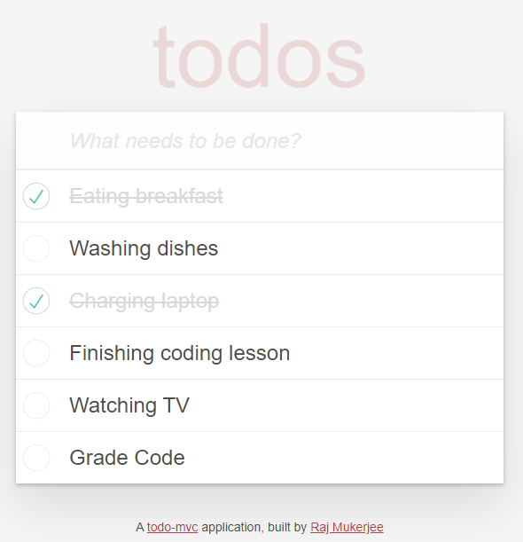

# ToDos

This is a single-page-app that was built using Ruby on Rails. A visitor can enter an item on the list and mark it as completed (or incomplete if needed). This was another opportunity to test using RSpec. Once again, PostgreSQL was used for managing the database. jQuery helps with DOM manipulation so that escaping or refreshing the page is not necessary.

The ToDoMVC template was used for the design. 

## Click [here](https://todoster-rajkumar-mukerjee.herokuapp.com/) for the live app.

This is the home page:

## Tools & Resources

* [Ruby on Rails](https://rubyonrails.org/) 
* [PostgreSQL](https://www.postgresql.org/)
* [jQuery](https://api.jquery.com/)
* [ToDoMVC](https://www.npmjs.com/package/todomvc-app-css)

Enjoy your day!